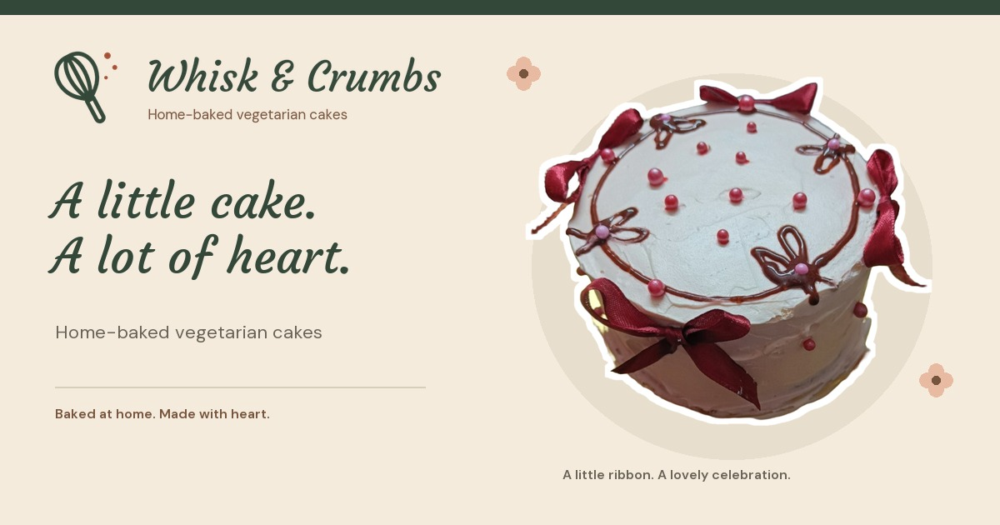
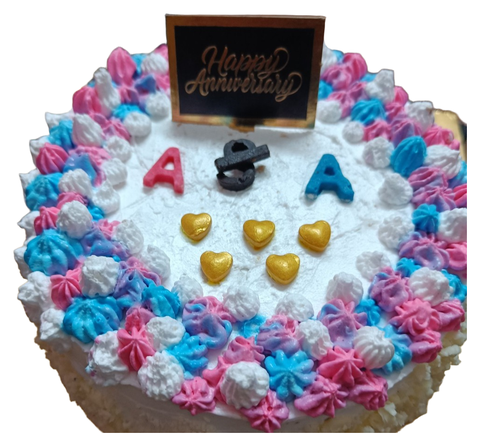
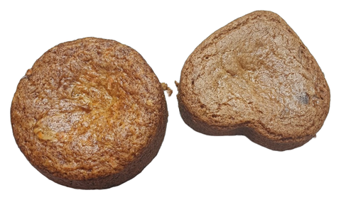
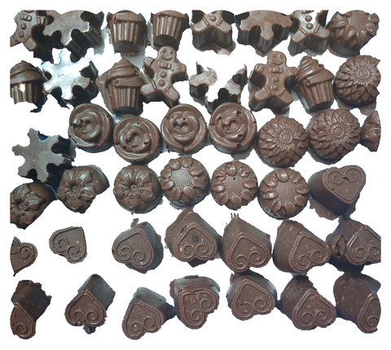
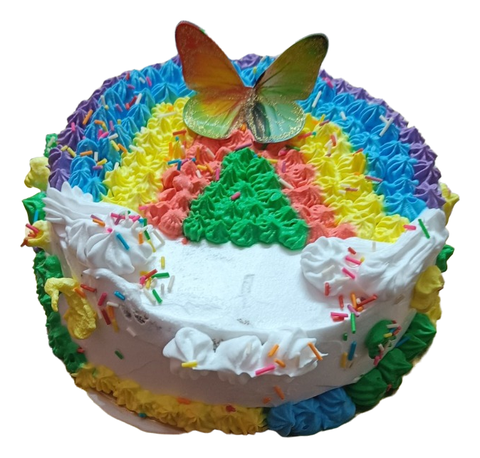
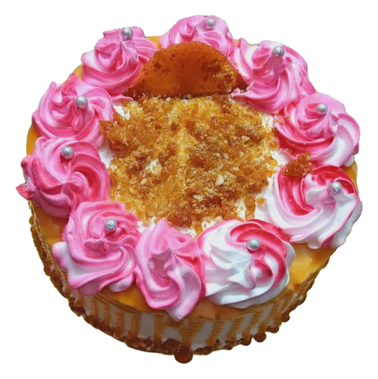

# About Whisk & Crumbs

This page preserves the written project overview moved from the image-only README.

**Home-baked vegetarian cakes.**

Visit the bakery: **https://zanark.github.io/WhiskAndCrumbs/**

  

<em>The singular Whisk &amp; Crumbs wordmark, original whisk-and-crumb mark and a real home-baked cake.</em>

## Step inside

The padded entrance is a complete illustrated bakery building: a tiled roof and
upper windows, warm plaster, a wooden illuminated fascia, substantial framing,
recessed glazing and a stone threshold meeting the paved ground.
Small original plants soften the edges. The building waits for a click, tap or keyboard activation.
The doors open, the hanging bell moves and a short local bell sound is attempted
from that gesture. Transparent door and display windows reveal one continuous original three-dimensional
bakery with layered painted materials, richly stocked walnut shelves and greenery.
Golden sunlight enters through the side window, with window-frame shadows,
soft contact shading and warm reflected light baked from the room's geometry.
The display cabinet reaches the floor; its cakes, shelves and shadows share one
perspective. The default viewpoint now looks straight ahead from eye level and
sits farther back, rather than looking down over the counter. Mouse movement gives a strong look around the room while the
outer storefront stays steady. Phones start with a centered view.
On supported phones, tap **Phone tilt**, allow motion access if asked, and hold the
phone comfortably while it calibrates. Gentle tilting then controls the same
look-around; tap **Tilt on** to turn it off. Motion stops when you enter, skip,
leave the page or enable reduced motion. The website uses motion readings locally
and does not save or upload them. Browser support and permission policies vary;
ordinary entry and Skip remain available if tilt cannot start.
Static illustrations from the same room remain available without the graphics enhancement.
This is decorative illustration, not a photograph of physical premises or an additional menu.
A small cream-and-green **We are OPEN** plaque hangs behind the right door's
glass, with a small cord and brass details. It moves with the door, not the room camera.
It is a welcoming illustration, not a business-hours notice.
A longer sloping canopy with forty narrower reddish-pink and cream stripes frames
the entrance. Each stripe ends in one matching curved flap of exactly the same
width, retaining the deep scalloped edge. The sloped fabric reaches both outer
edges without uncovered side strips. Visible bolted wall brackets and
angled tension rods support the projecting front bar; they stay rigid while
the cloth moves.
Wide layouts have fixed display bays beside the paired doors. Narrow layouts keep
the doorway and a separately composed upper floor, rather than squeezing all the
wide-building details into the same space.
The matching awning beneath the website header spans the full page width,
without inset side margins.
On the main page, the fabric responds strongly near the cursor, sending broader
waves across the cloth. The reaction lingers for a few seconds before settling,
and scrolling also makes the fabric flutter. Its rails and metal supports stay fixed.
Reduced-motion settings and browsers without the enhancement keep the static
canopy. This effect stays on the awning, not behind the reading text.
A visible **Skip entrance** link always offers a direct route in.

The website keeps a simple order: **Home, Our little story, Cakes we've made,
How to order**. Navigation stays visible on mobile.

At the top, the original whisk mark and Courgette shop name form a larger,
centered wooden sign with continuous visible grain, raised lettering and a warm,
steady backlit glow. Distinct cast shadows give the name and logo depth without
fading the wood behind them. The three navigation links now sit on the same
continuous wooden board, with cream lettering like the descriptor and a raised
wooden **How to order** button. There is no cream strip between the wood and canopy.
The glow does not
flash or animate; the original font and logo artwork are retained.

The real hero cake sits directly on the cream canvas, without an illustrated
window behind it. Small timber edges, a layered-paper recipe note,
a quiet linen surround beneath the notebooks and
a kitchen shelf near the footer carry the warm bakery mood through the page.
These details are static and decorative; reading areas and controls stay clear.

## Category notebooks

The introduction keeps its original cream background in a full-width section, without a notebook
frame or spiral. Its cake, headline and two actions remain; Our little story
still follows as its own section.

**Cakes we've made** is grouped into six top-spiral notebooks:
**Birthday Cakes, Tea cakes, Cream cakes, Decorated cakes, Doll cakes and Chocolates**.
Each cover has its own category-themed sticker pair rather than repeated hearts
and bows.
The notepads have **extra-pale blush-pink covers** with deep-green lettering, so they stand
apart from the cream website background. Inside pages stay cream, with fine sheet
edges and paired top-wire rings, without a wide left-hand spine.
Text-free pastel index tabs peek from the right side of each closed cover;
their attachment rectangles no longer show over the pink paper.
Click a category to zoom directly into its photos. **No notebook has a weight page.**
The cake weights we offer are mentioned once, above the notebook covers:
**1/2 KG, 1 KG, 1.5 KG, 2 KG, 2.5 KG and 3 KG**. This is information only;
there is nothing to select and no weight is added to an enquiry.

Notebook pages hold **four photos per page**, with fewer on the final page when
necessary. Open notebooks fit the screen **without horizontal or vertical scrolling**: images
and spacing adapt, with two-by-two pages on desktop/portrait phones and four
across on short landscape screens. The page count is not reduced to fit.
On multi-page notebooks, use **Back / Next**, the arrow keys, or drag the bottom
**Turn** control upward. Single-page notebooks do not show unnecessary page controls.
**All categories** returns to the covers. **Enlarge** opens the full photograph;
**Order** opens the direct contact link to start an order enquiry; it does not
confirm an order. Full accessible action names are retained.
The notebook's cream paper and pastel tabs are opaque, including the attachment
strips. Only the space outside its visible outline is transparent, keeping the
tabs clearly outside the paper. **All categories**, page controls and each photo's
**Enlarge / Order** tabs project beyond that outline, with generous click/tap areas.
Cake names and category headings use larger type, with clearly labelled,
generously sized controls.
Enlarged photographs also fit the screen; their titles and controls wrap without
forcing sideways scrolling.

All six covers now use real, reviewed sticker derivatives. The twelve earlier
examples are retained, with three new photograph records for Birthday Cakes,
Tea cakes and Chocolates. The tea photograph contains **two cakes**; the cover
count describes photos, not individual products. Black Forest remains on the
Cream cover.

  
  
  

<em>The Birthday, Tea and Chocolate cover images. The celebration cake keeps its real anniversary topper; both tea cakes and the chocolates' reflective details are retained. Original photographs are unchanged.</em>

  
  

<em>Two of the retained earlier designs. Separate sticker derivatives preserve visible details; full prepared photographs remain available on the website.</em>

The cream, deep-green and terracotta palette, clear handwritten headings and
readable body text are retained. Ruled lines stay away from reading text.
The cream background and quiet bakery outlines stay static. The experimental
pointer-reactive cream effect has been removed and parked for a possible future revisit.
The notebooks support click, touch, Enter and Space, with visible keyboard focus.
Reduced motion, forced colours, missing enhancements and no JavaScript show the
complete category pages directly. An extreme screen/text-size combination also
uses that readable full-page fallback rather than clipping content. Small screens
and enlarged text may need this fallback for the four-photo Decorated notebook;
the page is never silently reduced to fewer photographs.
Automated browser checks are not final visual
or native-device approval.

## Enquiries

Instagram: [@homemadevegcakes](https://www.instagram.com/homemadevegcakes/).
Customers tap **Message** on Instagram; login may be required.
The baker confirms availability, price and fulfilment personally.
**Following a link does not place or confirm an order.**

Most cake names describe visible past designs; Black Forest is an owner-confirmed
name. This is not a priced menu.
No contact number, delivery promise, review or dietary guarantee has been invented.

## Repository and publication

The display name is **Whisk & Crumbs**. The owner renamed the repository to
[Zanark/WhiskAndCrumbs](https://github.com/Zanark/WhiskAndCrumbs).
The website is **https://zanark.github.io/WhiskAndCrumbs/**.

GitHub Pages publishes only the **175 generated files in `site/`**, including the
category-notebook module, original decorative shop artwork and six landscape website showcase images.
The image-only README links six coordinated launch images to the website. Each
uses real, complete desktop and mobile browser viewport captures, with original
editorial device framing rather than cropped sections presented as screens.
The device frames are illustrations, not photographs of physical hardware.
The separate six-post **3:4 Instagram launch kit** uses phone-and-website
compositions only on the first and last posts. Its middle four posts focus on
genuine website features without phone mockups. Creating the kit does not post it.
The refreshed editorial edition uses larger supporting copy, clearer branding
and website-address placement, and more space for the complete feature views.
Its six-part sequence introduces the website, entrance, story, collection, photo
notebook and ordering, without changing the actual interface or product images.
The current launch images add original, softly lit cream blobs to their editorial
backgrounds. These are static artwork accents around the genuine website views,
not a new background effect inside the live website. Text, branding and the
captured interface remain unchanged; earlier launch editions are preserved.
This overview uses
the same public-ready product images. Authoring sources, original photos,
the account export, masks, private reviews and detailed maintenance guides remain
local; the public snapshot is not their backup.

The display-name choice is approved. Brand availability, trademark rights and
legal uniqueness have not been established.
